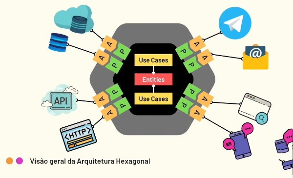

# Arquitetura Hexagonal com Springboot

Arquitetura hexagonal com Springboot.

## Sobre Arquitetura Hexagonal

Também conhecido como "Ports and Adapters Pattern", é um padrão arquitetural criado e documentado em 2005 por Alistair Cockburn (um dos autores do manifesto ágil - 2001).

### Ports (Portas)

São interfaces que estabelecem uma estrutura de comunicação com o domínio da aplicação de fora para dentro.
Temos dois tipos de portas:

- Potas de entrada (ou porta primária condutor - Driver)
  É uma interface utilizada por atores primários. Portas de entrada formam a API para comunicação com o hexágono.
  
- Portas de saída (ou porta secundária dirigida - Driven)
  É uma interface utilizada pelo o hexágono para execução de serviços externos, com banco de dados. Portas de saída
  formam a SPI para comunição externa.
 
### Adapters (Adaptadores)

São implementações das interfaces (portas) utilizando alguma tecnologia requerida pela solução.
Temos dois tipos de adaptadores:

- Adaptador condutor (Driver)
  É o compoente utilizado para conversão de uma solicitação de tecnologia específica em uma solicitação agnóstica
  e pura de sistema para uma porta condutora, traduzindo dados de entrada externos para dentro da solução.
  É responsável por fazer integração do lado de fora para dentro do hexágono.

- Adaptador dirigido (Driven)
  É o componente usado para converter chamadas de dentro da solução para fora, utilizando serviços de infraetrutura
  tecnológicos externos a solução. É responsável por fazer a integração de dentro do hexágono para fora dele.
  
### Hexágono
É a figura escolhida por Alistair Cockburn para ilustrar o que é mais importante para o problema de negócio que a
solução tenta resolver. É a parte mais importante do sistema, onde está concentrado todo o código que relaciona
com a lógica de negócios do contexto da solução.

 O hexágono deve ser totalmente agnóstico a qualquer tecnologia, framework e infraestrutura relacionado a UI,
 interfaces de comunicação e dispositivos externos do mundo real. No entanto, o hexágono pode ter dependências
 de framewroks de serviços gerais, como Logger, IoC...
